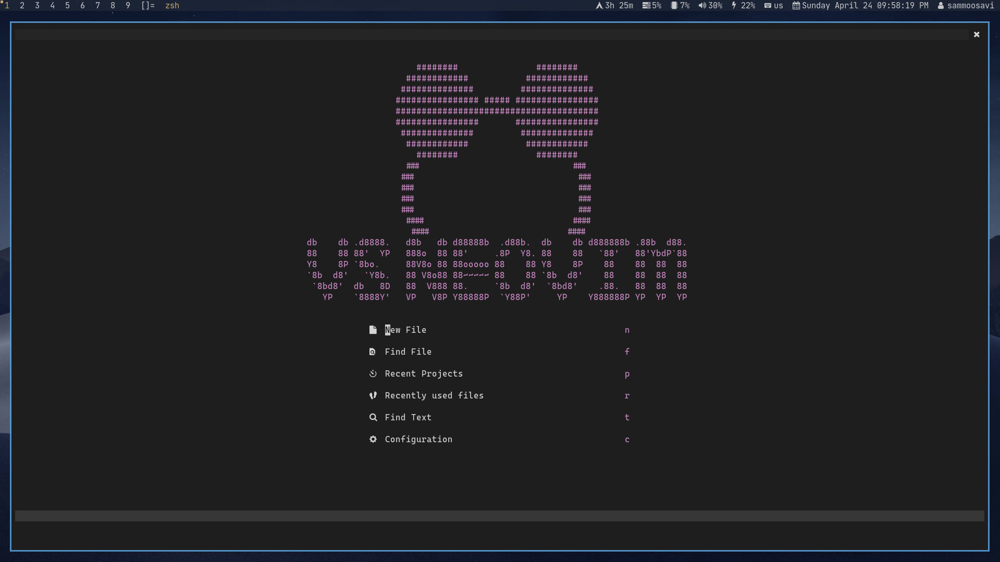
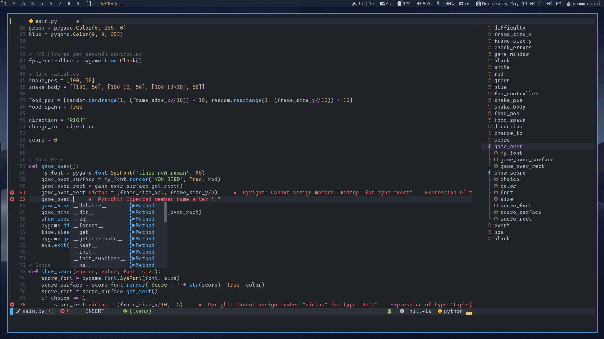
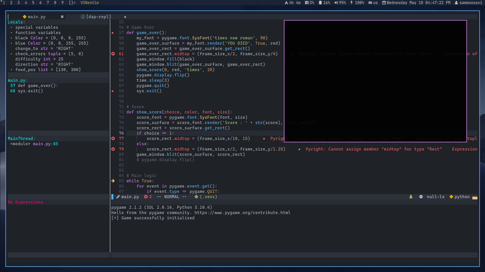

<div align="center">
  <a href="https://github.com/VSNeoVim/VSNeoVim/releases/latest">
    
  </a>
  <a href="https://github.com/VSNeoVim/VSNeoVim/commits">
    
  </a>
  <a href="https://github.com/VSNeoVim/VSNeoVim/blob/main/LICENSE">
    
  </a>
</div>

# Visual Studio NeoVim

## Documentation
You can find all the documentation for VSNeoVim at [wiki](https://github.com/VSNeoVim/VSNeoVim/wiki)

**NOTE:** for running VSNeoVim write ``$ vsn`` or ``$ vsn [file]`` command

## Installation

for install stable release : 

```bash
bash <(curl -s https://raw.githubusercontent.com/vsneovim/vsneovim/main/utils/installer/install.sh)
```

## Configuration file
To install plugins configure VSNeoVim use the `config.lua` located here: `~/.config/vsn/config.lua`

Example : 

```lua
vsn = {
  options = {
    backup = false,
    conceallevel = 0,
    fileencoding = 'utf-8',
    hlsearch = true,
    ignorecase = true,
    mouse = 'a',
    pumheight = 10,
    showmode = false,
    showtabline = 2,
    smartcase = true,
    smartindent = true,
    splitbelow = true,
    splitright = true,
    swapfile = false,
    timeoutlen = 100,
    undofile = true,
    updatetime = 300,
    writebackup = false,
    expandtab = true,
    shiftwidth = 2,
    tabstop = 2,
    cursorline = true,
    number = true,
    relativenumber = false,
    numberwidth = 4,
    signcolumn = 'yes',
    wrap = false,
    scrolloff = 8,
    sidescrolloff = 8,
    background = 'dark',
    cmdheight = 2,
  },
  global = {
    theme = 'onedarker',
--    theme = 'Darkup',
  },
  keybindings = {
    localleader = " ",
    leader = " ",
  },
  extensions = {
    -- adding your extensions with this template
    -- {"url", run="", config="", etc...}
    {"VSNeoVim/Darkup.nvim"},
    {"VSNeoVim/onedarker.nvim"}
  },
  configs = {
    TreeIcons = {enabled = true},
    FileExplorer = {enabled = true, width = 30, position = "left", icons = true, diagnostics = true, open_file_on_new_tab = false, enable_git = true, hidden_ignore_files = true},
    BufferLine = {enabled = true},
    Terminal = {enabled = true},
    IndentLine = {enabled = true},
    WhichKey = {enabled = true},
    CMP = {enabled = true},
    LSP = {enabled = true, virtual_text = true, virtual_text_prefix = "● ", update_in_insert = true, underline = true},
    LSPInstaller = {enabled = true},
    Telescope = {enabled = true},
    Colorizer = {enabled = true},
    Tabnine = {enabled = true},
    Treesitter = {enabled = true},
    Git = {enabled = true},
    DAPInstall = {enabled = true},
    DAP = {enabled = true},
    DAPUI = {enabled = true},
    GitUi = {enabled = true},
  }
}
```


## Install Language support

- Enter `:LspInstall` followed by `<TAB>` to see your options for LSP

- Enter `:TSInstall` followed by `<TAB>` to see your options for syntax highlighting

## Screen environment




## Resources

- [Documentation](https://github.com/VSNeoVim/VSNeoVim/wiki)
- [Donate](https://www.payping.ir/@sameet)
