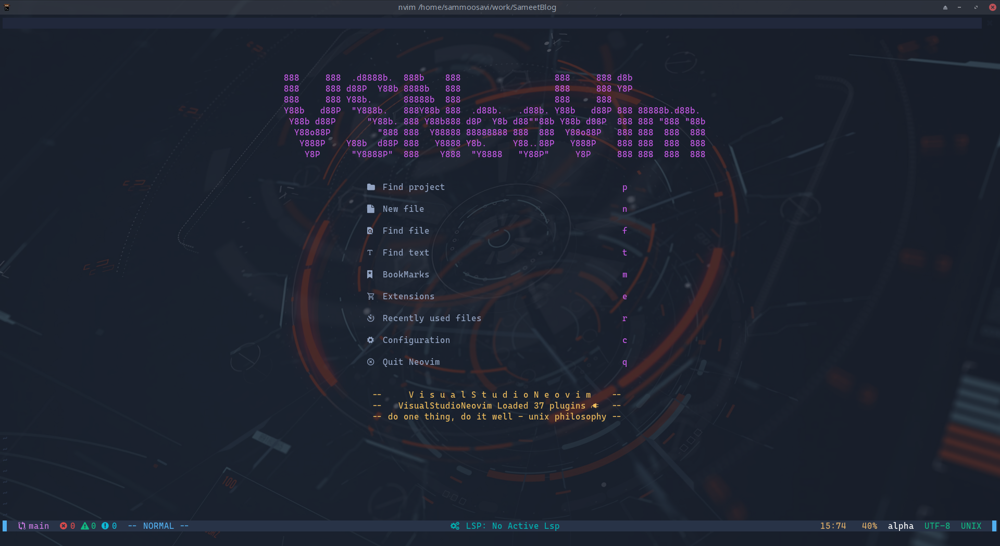
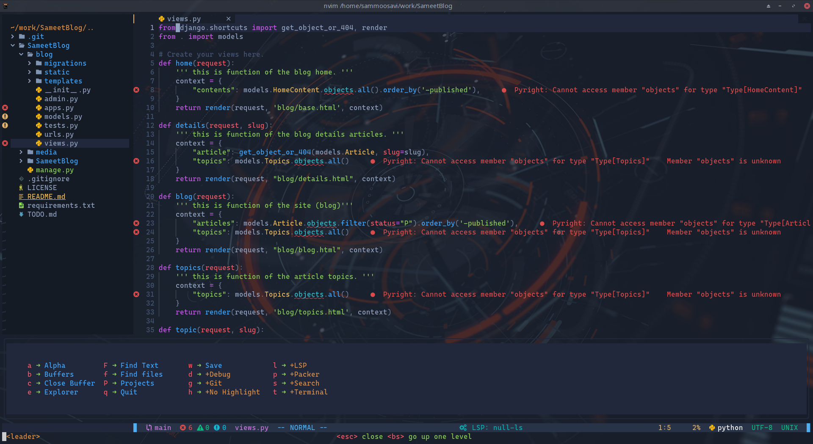
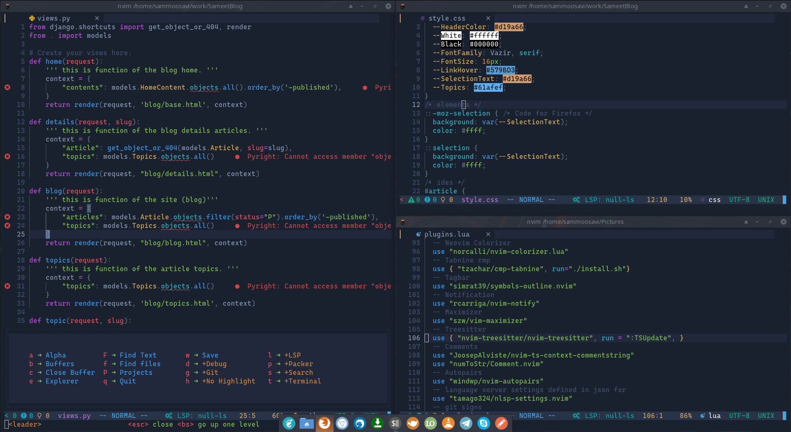

<div align="center">
  <a href="https://github.com/VSNeoVim/VSNeoVim/releases/latest">
    
  </a>
  <a href="https://github.com/VSNeoVim/VSNeoVim/commits">
    
  </a>
  <a href="https://github.com/VSNeoVim/VSNeoVim/blob/main/LICENSE">
    
  </a>
</div>

# Visual Studio NeoVim

## Documentation
You can find all the documentation for VSNeoVim at [wiki](https://github.com/VSNeoVim/VSNeoVim/wiki)

## Installation

```bash
wget https://raw.githubusercontent.com/vsneovim/vsneovim/main/utils/install.sh && chmod +x install.sh && ./install.sh -i
```

## Requirements
- neovim 6+
- lua and luajit
- python 3+
- npm
- yarn
- node
- python-pip 3+
- lazygit
- treesitter

## Install Language support

- Enter `:LspInstall` followed by `<TAB>` to see your options for LSP

- Enter `:TSInstall` followed by `<TAB>` to see your options for syntax highlighting

## Screen environment




## Resources


- [Documentation](https://github.com/VSNeoVim/VSNeoVim/wiki)
- [YouTube](https://www.youtube.com/channel/UC_XJ4oRW4qL2Cmi7VHo9KsQ)
- [Donate](https://www.payping.ir/@sameet)
