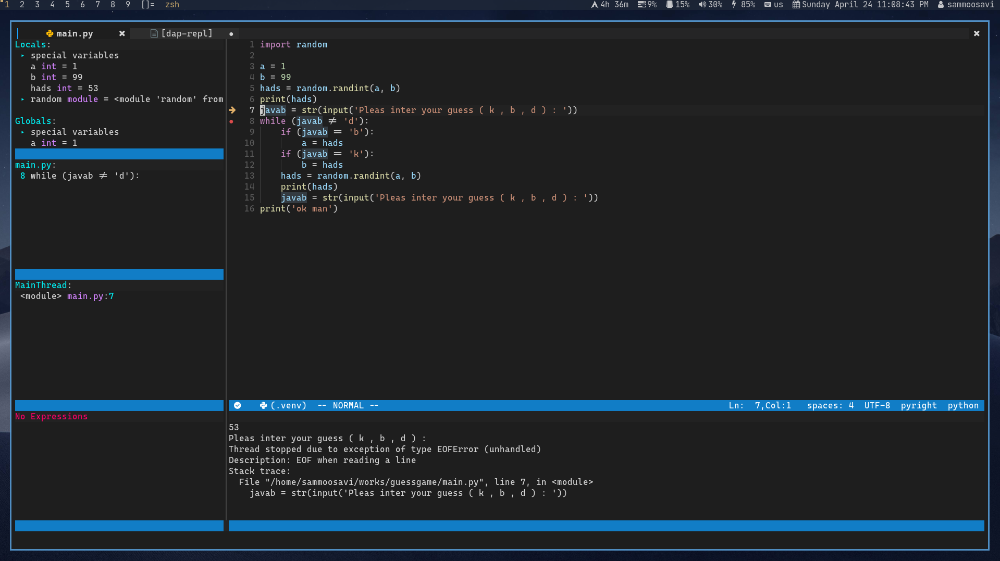
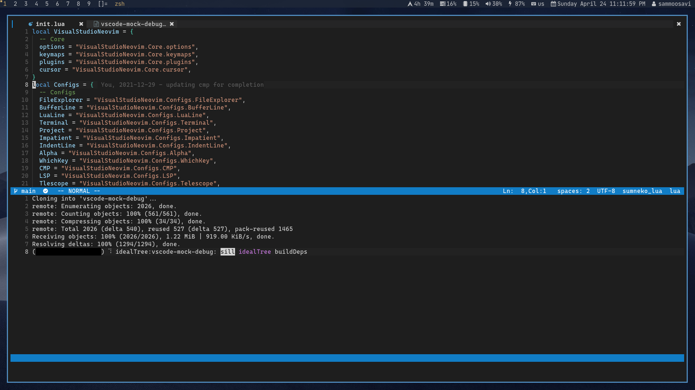

```
                                  ########               ########                                  
                                ############           ############                                
                               ##############         ##############                               
                              ################ ##### ################                              
                              #######################################                              
                              ################       ################                              
                               ##############         ##############                               
                                ############           ############                                
                                  ########               ########                                  
                                ###                             ###                                
                               ###                               ###                               
                               ###                               ###                               
                               ###                               ###                               
                               ###                               ###                               
                                ####                            ####                               
                                 ####                          ####                                
             db    db .d8888.   d8b   db d88888b  .d88b.  db    db d888888b .88b  d88.             
             88    88 88'  YP   888o  88 88'     .8P  Y8. 88    88   `88'   88'YbdP`88             
             Y8    8P `8bo.     88V8o 88 88ooooo 88    88 Y8    8P    88    88  88  88             
             `8b  d8'   `Y8b.   88 V8o88 88~~~~~ 88    88 `8b  d8'    88    88  88  88             
              `8bd8'  db   8D   88  V888 88.     `8b  d8'  `8bd8'    .88.   88  88  88             
                YP    `8888Y'   VP   V8P Y88888P  `Y88P'     YP    Y888888P YP  YP  YP             
```
<div align="center">
  <a href="https://github.com/VSNeoVim/VSNeoVim/releases/latest">
    
  </a>
  <a href="https://github.com/VSNeoVim/VSNeoVim/commits">
    
  </a>
  <a href="https://github.com/VSNeoVim/VSNeoVim/blob/main/LICENSE">
    
  </a>
</div>

# Visual Studio NeoVim

## Documentation
You can find all the documentation for VSNeoVim at [wiki](https://github.com/VSNeoVim/VSNeoVim/wiki)

## Installation

```bash
bash <(curl -s https://raw.githubusercontent.com/vsneovim/vsneovim/main/utils/install.sh)
```

## Requirements
- neovim 6+
- lua and luajit
- python 3+
- npm
- yarn
- node
- python-pip 3+
- lazygit
- treesitter

## Install Language support

- Enter `:LspInstall` followed by `<TAB>` to see your options for LSP

- Enter `:TSInstall` followed by `<TAB>` to see your options for syntax highlighting

## Screen environment




## Resources

- [Documentation](https://github.com/VSNeoVim/VSNeoVim/wiki)
- [Donate](https://www.payping.ir/@sameet)
